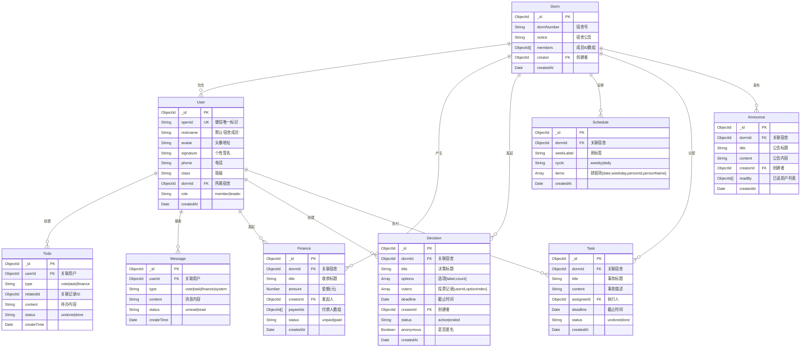

```mermaid
erDiagram
    User {
        ObjectId _id PK
        String openid UK "微信唯一标识"
        String nickname "默认'宿舍成员'"
        String avatar "头像地址"
        String signature "个性签名"
        String phone "电话"
        String class "班级"
        ObjectId dormId FK "所属宿舍"
        String role "member|leader"
        Date createdAt
    }

    Dorm {
        ObjectId _id PK
        String dormNumber "宿舍号"
        String notice "宿舍公告"
        ObjectId[] members "成员ID数组"
        ObjectId creator FK "创建者"
        Date createdAt
    }

    Finance {
        ObjectId _id PK
        ObjectId dormId FK "关联宿舍"
        String title "收款标题"
        Number amount "金额(元)"
        ObjectId creatorId FK "发起人"
        ObjectId[] payeeIds "付款人数组"
        String status "unpaid|paid"
        Date createdAt
    }

    Decision {
        ObjectId _id PK
        ObjectId dormId FK "关联宿舍"
        String title "决策标题"
        Array options "选项[label,count]"
        Array voters "投票记录[userId,optionIndex]"
        Date deadline "截止时间"
        ObjectId creatorId FK "创建者"
        String status "active|ended"
        Boolean anonymous "是否匿名"
        Date createdAt
    }

    Schedule {
        ObjectId _id PK
        ObjectId dormId FK "关联宿舍"
        String weekLabel "周标签"
        String cycle "weekly|daily"
        Array items "排班项[date,weekday,personId,personName]"
        Date createdAt
    }

    Message {
        ObjectId _id PK
        ObjectId userId FK "关联用户"
        String type "vote|task|finance|system"
        String content "消息内容"
        String status "unread|read"
        Date createTime
    }

    Todo {
        ObjectId _id PK
        ObjectId userId FK "关联用户"
        String type "vote|task|finance"
        ObjectId relatedId "关联记录ID"
        String content "待办内容"
        String status "undone|done"
        Date createTime
    }

    Task {
        ObjectId _id PK
        ObjectId dormId FK "关联宿舍"
        String title "事务标题"
        String content "事务描述"
        ObjectId assigneeId FK "执行人"
        Date deadline "截止时间"
        String status "undone|done"
        Date createdAt
    }

    Announce {
        ObjectId _id PK
        ObjectId dormId FK "关联宿舍"
        String title "公告标题"
        String content "公告内容"
        ObjectId creatorId FK "创建者"
        ObjectId[] readBy "已读用户列表"
        Date createdAt
    }

    Dorm ||--o{ User : "包含"
    Dorm ||--o{ Finance : "产生"
    Dorm ||--o{ Decision : "发起"
    Dorm ||--o{ Schedule : "安排"
    Dorm ||--o{ Task : "分配"
    Dorm ||--o{ Announce : "发布"
    User ||--o{ Todo : "创建"
    User ||--o{ Message : "接收"
    User ||--o{ Finance : "发起"
    User ||--o{ Decision : "创建"
    User ||--o{ Task : "执行"
```
