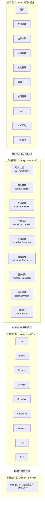

```mermaid
graph TD
    subgraph P1["表现层（UniApp 微信小程序）"]
        p1["首页"]
        p2["费用管理"]
        p3["投票决策"]
        p4["排班管理"]
        p5["公告管理"]
        p6["消息中心"]
        p7["成员管理"]
        p8["个人中心"]
        p9["i18n国际化"]
        p10["夜间模式"]
    end

    subgraph P2["业务逻辑层（Node.js + Express）"]
        b1["用户认证 JWT\nuserController"]
        b2["宿舍管理\ndormController"]
        b3["费用管理\nfinanceController"]
        b4["投票决策\ndecisionController"]
        b5["排班管理\nscheduleController"]
        b6["公告管理\nannounceController"]
        b7["消息通知\nmessageController"]
        b8["待办事项\ntodoController"]
        b9["AI排班\nDeepSeek API"]
    end

    subgraph P3["数据访问层（Mongoose ODM）"]
        d1["User"]
        d2["Dorm"]
        d3["Finance"]
        d4["Decision"]
        d5["Schedule"]
        d6["Announce"]
        d7["Message"]
        d8["Todo"]
        d9["Task"]
    end

    subgraph P4["数据存储层（MongoDB Atlas）"]
        db["MongoDB 文档型数据库\n（云数据库服务）"]
    end

    P1 -->|"HTTP / RESTful API"| P2
    P2 -->|"Mongoose 数据操作"| P3
    P3 -->|"BSON 文档存储"| P4
```
