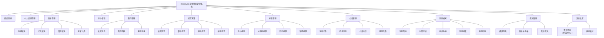

```mermaid
graph TD
    root["DormSync 宿舍协同管理系统"]

    root --- m1["微信登录"]
    root --- m2["个人信息管理"]
    root --- m3["宿舍管理"]
    root --- m4["待办事项"]
    root --- m5["费用管理"]
    root --- m6["投票决策"]
    root --- m7["排班管理"]
    root --- m8["公告管理"]
    root --- m9["消息通知"]
    root --- m10["成员管理"]
    root --- m11["系统设置"]

    m3 --- m3a["创建宿舍"]
    m3 --- m3b["加入宿舍"]
    m3 --- m3c["离开宿舍"]
    m3 --- m3d["更新公告"]

    m5 --- m5a["发起收款"]
    m5 --- m5b["费用列表"]
    m5 --- m5c["删除记录"]

    m6 --- m6a["发起投票"]
    m6 --- m6b["参与投票"]
    m6 --- m6c["匿名投票"]
    m6 --- m6d["编辑投票"]

    m7 --- m7a["手动排班"]
    m7 --- m7b["AI智能排班"]
    m7 --- m7c["历史排班"]
    m7 --- m7d["当前排班"]

    m8 --- m8a["发布公告"]
    m8 --- m8b["已读追踪"]
    m8 --- m8c["公告详情"]
    m8 --- m8d["删除公告"]

    m9 --- m9a["消息筛选"]
    m9 --- m9b["全部已读"]
    m9 --- m9c["未读角标"]
    m9 --- m9d["消息搜索"]
    m9 --- m9e["删除消息"]

    m10 --- m10a["成员列表"]
    m10 --- m10b["宿舍长选举"]
    m10 --- m10c["邀请成员"]

    m11 --- m11a["语言切换\n（中/英/韩/日）"]
    m11 --- m11b["夜间模式"]
```
