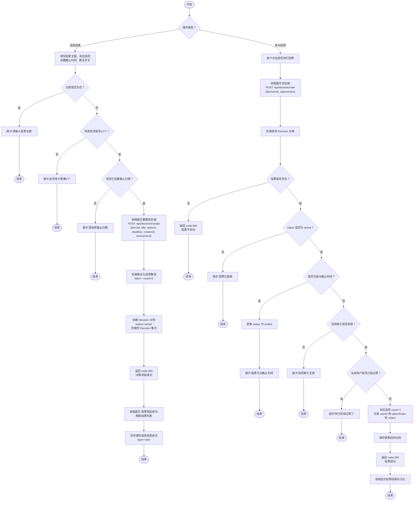

```mermaid
flowchart TD
    A([开始]) --> B{"操作类型？"}

    B -- 发起投票 --> C["填写投票主题、添加选项\n设置截止时间、匿名开关"]
    C --> D{"主题是否为空？"}
    D -- 是 --> D1["提示'请输入投票主题'"]
    D1 --> Z1([结束])
    D -- 否 --> E{"有效选项是否≥2个？"}
    E -- 否 --> E1["提示'选项至少需要2个'"]
    E1 --> Z2([结束])
    E -- 是 --> F{"是否已设置截止日期？"}
    F -- 否 --> F1["提示'请选择截止日期'"]
    F1 --> Z3([结束])
    F -- 是 --> G["前端提交数据至后端\nPOST /api/decision/create\n{dormId, title, options, deadline, creatorId, anonymous}"]
    G --> H["后端格式化选项数组\nlabel + count=0"]
    H --> I["创建 Decision 文档\nstatus='active'\n存储至 Decision 集合"]
    I --> J["返回 code:200\n'决策发起成功'"]
    J --> K["前端提示'投票发起成功'\n刷新投票列表"]
    K --> L["异步通知宿舍其他成员\ntype='vote'"]
    L --> Z4([结束])

    B -- 参与投票 --> M["用户点击选项进行投票"]
    M --> N["前端提交至后端\nPOST /api/decision/vote\n{decisionId, optionIndex}"]
    N --> O["后端查询 Decision 文档"]
    O --> P{"投票是否存在？"}
    P -- 否 --> P1["返回 code:404\n'投票不存在'"]
    P1 --> Z5([结束])
    P -- 是 --> Q{"status 是否为 active？"}
    Q -- 否 --> Q1["提示'投票已结束'"]
    Q1 --> Z6([结束])
    Q -- 是 --> R{"是否已超过截止时间？"}
    R -- 是 --> R1["更新 status 为 ended"]
    R1 --> R2["提示'投票已过截止时间'"]
    R2 --> Z7([结束])
    R -- 否 --> S{"选项索引是否有效？"}
    S -- 否 --> S1["提示'选项索引无效'"]
    S1 --> Z8([结束])
    S -- 是 --> T{"当前用户是否已投过票？"}
    T -- 是 --> T1["提示'你已经投过票了'"]
    T1 --> Z9([结束])
    T -- 否 --> U["对应选项 count+1\n记录 userId 和 optionIndex 到 voters"]
    U --> V["保存更新后的文档"]
    V --> W["返回 code:200\n'投票成功'"]
    W --> X["前端显示投票结果百分比"]
    X --> Z10([结束])
```
