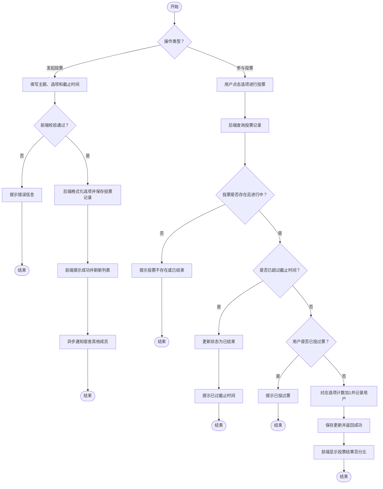

```mermaid
flowchart TD
    A([开始]) --> B{"操作类型？"}

    B -- 发起投票 --> C["填写主题、选项和截止时间"]
    C --> D{"前端校验通过？"}
    D -- 否 --> E["提示错误信息"]
    E --> Z1([结束])
    D -- 是 --> F["后端格式化选项并保存投票记录"]
    F --> G["前端提示成功并刷新列表"]
    G --> H["异步通知宿舍其他成员"]
    H --> Z2([结束])

    B -- 参与投票 --> I["用户点击选项进行投票"]
    I --> J["后端查询投票记录"]
    J --> K{"投票是否存在且进行中？"}
    K -- 否 --> L["提示投票不存在或已结束"]
    L --> Z3([结束])
    K -- 是 --> M{"是否已超过截止时间？"}
    M -- 是 --> N["更新状态为已结束"]
    N --> O["提示已过截止时间"]
    O --> Z4([结束])
    M -- 否 --> P{"用户是否已投过票？"}
    P -- 是 --> Q["提示已投过票"]
    Q --> Z5([结束])
    P -- 否 --> R["对应选项计数加1并记录用户"]
    R --> S["保存更新并返回成功"]
    S --> T["前端显示投票结果百分比"]
    T --> Z6([结束])
```
