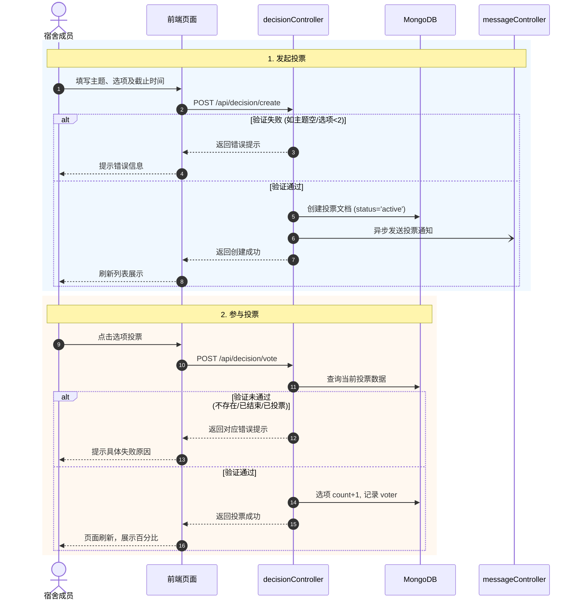

```mermaid
sequenceDiagram
    autonumber
    actor U as 宿舍成员
    participant F as 前端页面
    participant B as decisionController
    participant DB as MongoDB
    participant M as messageController

    %% ---------------- 发起投票阶段 ----------------
    rect rgb(240, 248, 255)
    Note over U, M: 1. 发起投票
    U->>F: 填写主题、选项及截止时间
    F->>B: POST /api/decision/create

    alt 验证失败 (如主题空/选项<2)
        B-->>F: 返回错误提示
        F-->>U: 提示错误信息
    else 验证通过
        B->>DB: 创建投票文档 (status='active')
        B-)M: 异步发送投票通知
        B-->>F: 返回创建成功
        F-->>U: 刷新列表展示
    end
    end

    %% ---------------- 参与投票阶段 ----------------
    rect rgb(255, 248, 240)
    Note over U, DB: 2. 参与投票
    U->>F: 点击选项投票
    F->>B: POST /api/decision/vote
    B->>DB: 查询当前投票数据

    alt 验证未通过 (不存在/已结束/已投票)
        B-->>F: 返回对应错误提示
        F-->>U: 提示具体失败原因
    else 验证通过
        B->>DB: 选项 count+1, 记录 voter
        B-->>F: 返回投票成功
        F-->>U: 页面刷新，展示百分比
    end
    end
```
