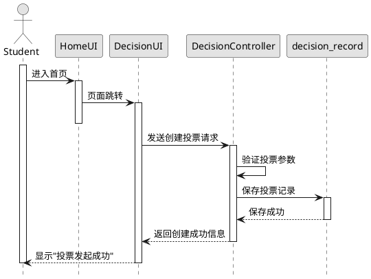

```plantuml
@startuml
skinparam monochrome true
skinparam maxMessageSize 100
skinparam responseMessageBelowArrow true
hide footbox

actor Student
participant HomeUI
participant DecisionUI
participant DecisionController
participant decision_record

activate Student

Student -> HomeUI: 进入首页
activate HomeUI

HomeUI -> DecisionUI: 页面跳转
activate DecisionUI
deactivate HomeUI

DecisionUI -> DecisionController: 发送创建投票请求
activate DecisionController

DecisionController -> DecisionController: 验证投票参数
DecisionController -> decision_record: 保存投票记录
activate decision_record

decision_record --> DecisionController: 保存成功
deactivate decision_record

DecisionController --> DecisionUI: 返回创建成功信息
deactivate DecisionController

DecisionUI --> Student: 显示"投票发起成功"
deactivate DecisionUI

deactivate Student
@enduml
```
