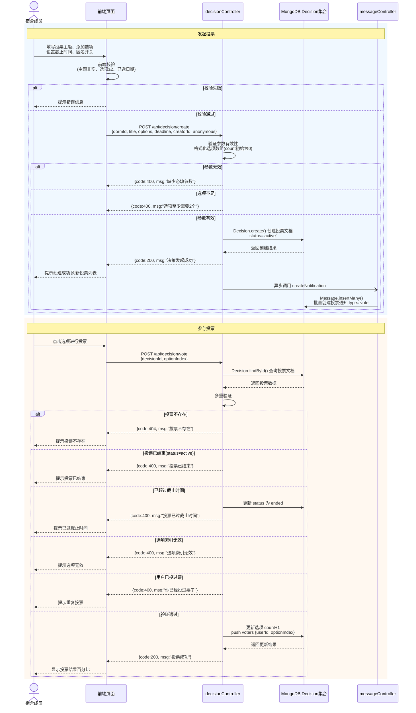

```mermaid
sequenceDiagram
    actor 用户 as 宿舍成员
    participant 前端 as 前端页面
    participant 后端 as decisionController
    participant DB as MongoDB Decision集合
    participant 消息 as messageController

    rect rgb(240, 248, 255)
    Note over 用户, 消息: 发起投票
    用户->>前端: 填写投票主题、添加选项<br/>设置截止时间、匿名开关
    前端->>前端: 前端校验<br/>(主题非空、选项≥2、已选日期)

    alt 校验失败
        前端-->>用户: 提示错误信息
    else 校验通过
        前端->>后端: POST /api/decision/create<br/>{dormId, title, options, deadline, creatorId, anonymous}
        后端->>后端: 验证参数有效性<br/>格式化选项数组(count初始为0)

        alt 参数无效
            后端-->>前端: {code:400, msg:"缺少必填参数"}
        else 选项不足
            后端-->>前端: {code:400, msg:"选项至少需要2个"}
        else 参数有效
            后端->>DB: Decision.create() 创建投票文档<br/>status='active'
            DB-->>后端: 返回创建结果
            后端-->>前端: {code:200, msg:"决策发起成功"}
            前端-->>用户: 提示创建成功 刷新投票列表

            后端-)消息: 异步调用 createNotification
            消息->>DB: Message.insertMany()<br/>批量创建投票通知 type='vote'
        end
    end
    end

    rect rgb(255, 248, 240)
    Note over 用户, 消息: 参与投票
    用户->>前端: 点击选项进行投票
    前端->>后端: POST /api/decision/vote<br/>{decisionId, optionIndex}
    后端->>DB: Decision.findById() 查询投票文档
    DB-->>后端: 返回投票数据

    后端->>后端: 多重验证

    alt 投票不存在
        后端-->>前端: {code:404, msg:"投票不存在"}
        前端-->>用户: 提示投票不存在
    else 投票已结束(status≠active)
        后端-->>前端: {code:400, msg:"投票已结束"}
        前端-->>用户: 提示投票已结束
    else 已超过截止时间
        后端->>DB: 更新 status 为 ended
        后端-->>前端: {code:400, msg:"投票已过截止时间"}
        前端-->>用户: 提示已过截止时间
    else 选项索引无效
        后端-->>前端: {code:400, msg:"选项索引无效"}
        前端-->>用户: 提示选项无效
    else 用户已投过票
        后端-->>前端: {code:400, msg:"你已经投过票了"}
        前端-->>用户: 提示重复投票
    else 验证通过
        后端->>DB: 更新选项 count+1<br/>push voters {userId, optionIndex}
        DB-->>后端: 返回更新结果
        后端-->>前端: {code:200, msg:"投票成功"}
        前端-->>用户: 显示投票结果百分比
    end
    end
```
