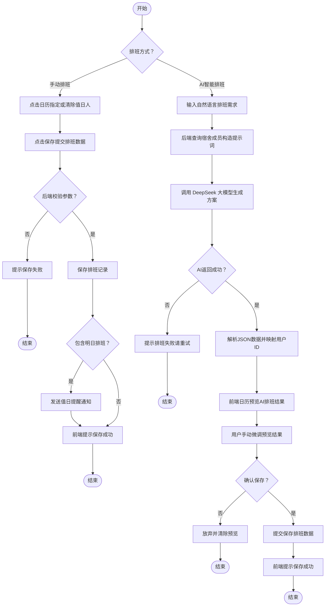

```mermaid
flowchart TD
    A([开始]) --> B{"排班方式？"}

    B -- 手动排班 --> C["点击日历指定或清除值日人"]
    C --> D["点击保存提交排班数据"]
    D --> E{"后端校验参数？"}
    E -- 否 --> F["提示保存失败"]
    F --> Z1([结束])
    E -- 是 --> G["保存排班记录"]
    G --> H{"包含明日排班？"}
    H -- 是 --> I["发送值日提醒通知"]
    I --> J["前端提示保存成功"]
    H -- 否 --> J
    J --> Z2([结束])

    B -- AI智能排班 --> K["输入自然语言排班需求"]
    K --> L["后端查询宿舍成员构造提示词"]
    L --> M["调用 DeepSeek 大模型生成方案"]
    M --> N{"AI返回成功？"}
    N -- 否 --> O["提示排班失败请重试"]
    O --> Z3([结束])
    N -- 是 --> P["解析JSON数据并映射用户ID"]
    P --> Q["前端日历预览AI排班结果"]
    Q --> R["用户手动微调预览结果"]
    R --> S{"确认保存？"}
    S -- 否 --> T["放弃并清除预览"]
    T --> Z4([结束])
    S -- 是 --> U["提交保存排班数据"]
    U --> V["前端提示保存成功"]
    V --> Z5([结束])
```
