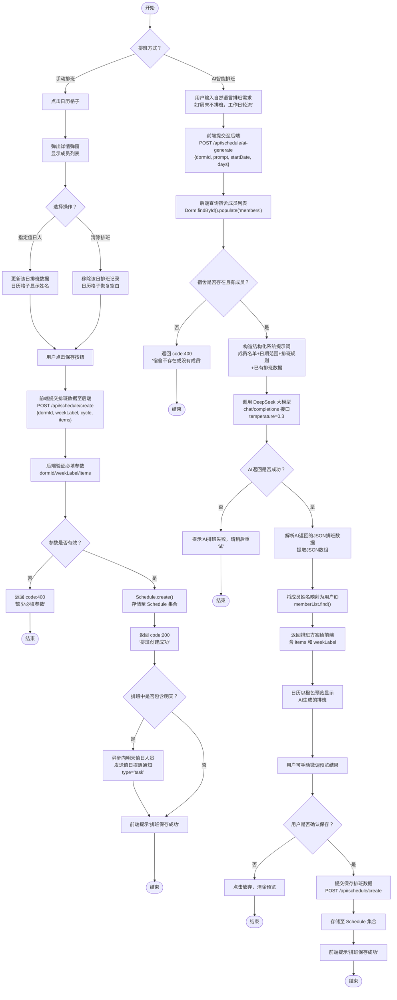

```mermaid
flowchart TD
    A([开始]) --> B{"排班方式？"}

    B -- 手动排班 --> C["点击日历格子"]
    C --> D["弹出详情弹窗\n显示成员列表"]
    D --> E{"选择操作？"}
    E -- 指定值日人 --> F["更新该日排班数据\n日历格子显示姓名"]
    E -- 清除排班 --> G["移除该日排班记录\n日历格子恢复空白"]
    F --> H["用户点击保存按钮"]
    G --> H
    H --> I["前端提交排班数据至后端\nPOST /api/schedule/create\n{dormId, weekLabel, cycle, items}"]
    I --> J["后端验证必填参数\ndormId/weekLabel/items"]
    J --> K{"参数是否有效？"}
    K -- 否 --> K1["返回 code:400\n'缺少必填参数'"]
    K1 --> Z1([结束])
    K -- 是 --> L["Schedule.create()\n存储至 Schedule 集合"]
    L --> M["返回 code:200\n'排班创建成功'"]
    M --> N{"排班中是否包含明天？"}
    N -- 是 --> O["异步向明天值日人员\n发送值日提醒通知\ntype='task'"]
    O --> P["前端提示'排班保存成功'"]
    N -- 否 --> P
    P --> Z2([结束])

    B -- AI智能排班 --> Q["用户输入自然语言排班需求\n如'周末不排班，工作日轮流'"]
    Q --> R["前端提交至后端\nPOST /api/schedule/ai-generate\n{dormId, prompt, startDate, days}"]
    R --> S["后端查询宿舍成员列表\nDorm.findById().populate('members')"]
    S --> S1{"宿舍是否存在且有成员？"}
    S1 -- 否 --> S2["返回 code:400\n'宿舍不存在或没有成员'"]
    S2 --> Z3([结束])
    S1 -- 是 --> T["构造结构化系统提示词\n成员名单+日期范围+排班规则\n+已有排班数据"]
    T --> U["调用 DeepSeek 大模型\nchat/completions 接口\ntemperature=0.3"]
    U --> V{"AI返回是否成功？"}
    V -- 否 --> V1["提示'AI排班失败，请稍后重试'"]
    V1 --> Z4([结束])
    V -- 是 --> W["解析AI返回的JSON排班数据\n提取JSON数组"]
    W --> X["将成员姓名映射为用户ID\nmemberList.find()"]
    X --> Y["返回排班方案给前端\n含 items 和 weekLabel"]
    Y --> Y1["日历以橙色预览显示\nAI生成的排班"]
    Y1 --> Y2["用户可手动微调预览结果"]
    Y2 --> Y3{"用户是否确认保存？"}
    Y3 -- 否 --> Y4["点击放弃，清除预览"]
    Y4 --> Z5([结束])
    Y3 -- 是 --> Y5["提交保存排班数据\nPOST /api/schedule/create"]
    Y5 --> Y6["存储至 Schedule 集合"]
    Y6 --> Y7["前端提示'排班保存成功'"]
    Y7 --> Z6([结束])
```
