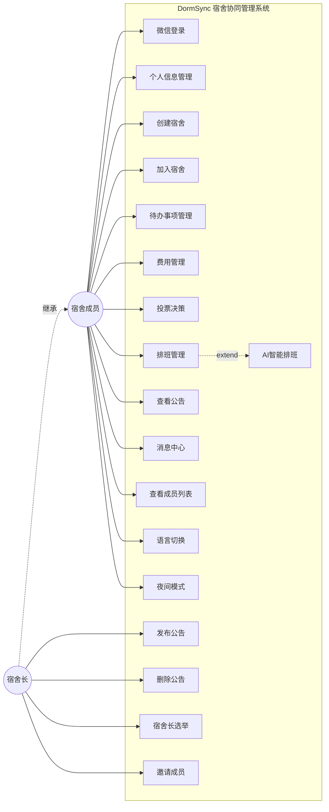

```mermaid
graph LR
    member(("宿舍成员"))
    leader(("宿舍长"))

    subgraph DormSync["DormSync 宿舍协同管理系统"]
        UC1["微信登录"]
        UC2["个人信息管理"]
        UC3["创建宿舍"]
        UC4["加入宿舍"]
        UC5["待办事项管理"]
        UC6["费用管理"]
        UC7["投票决策"]
        UC8["排班管理"]
        UC9["查看公告"]
        UC10["消息中心"]
        UC11["查看成员列表"]
        UC12["语言切换"]
        UC13["夜间模式"]
        UC14["发布公告"]
        UC15["删除公告"]
        UC16["宿舍长选举"]
        UC17["邀请成员"]
        UC18["AI智能排班"]
    end

    member --> UC1
    member --> UC2
    member --> UC3
    member --> UC4
    member --> UC5
    member --> UC6
    member --> UC7
    member --> UC8
    member --> UC9
    member --> UC10
    member --> UC11
    member --> UC12
    member --> UC13

    leader -.->|继承| member
    leader --> UC14
    leader --> UC15
    leader --> UC16
    leader --> UC17

    UC8 -.->|extend| UC18
```
