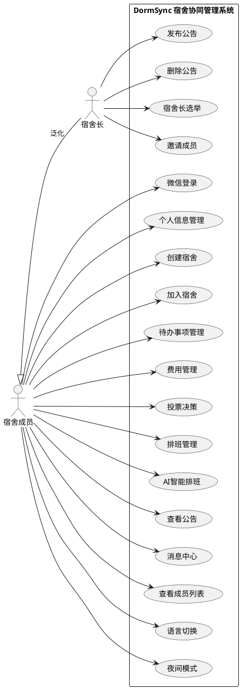

```plantuml
@startuml
left to right direction
skinparam packageStyle rectangle

actor "宿舍长" as leader
actor "宿舍成员" as member

rectangle "DormSync 宿舍协同管理系统" {
  usecase "发布公告" as UC1
  usecase "删除公告" as UC2
  usecase "宿舍长选举" as UC3
  usecase "邀请成员" as UC4

  usecase "微信登录" as UC5
  usecase "个人信息管理" as UC6
  usecase "创建宿舍" as UC7
  usecase "加入宿舍" as UC8
  usecase "待办事项管理" as UC9
  usecase "费用管理" as UC10
  usecase "投票决策" as UC11
  usecase "排班管理" as UC12
  usecase "AI智能排班" as UC13
  usecase "查看公告" as UC14
  usecase "消息中心" as UC15
  usecase "查看成员列表" as UC16
  usecase "语言切换" as UC17
  usecase "夜间模式" as UC18
}

leader --> UC1
leader --> UC2
leader --> UC3
leader --> UC4

member --> UC5
member --> UC6
member --> UC7
member --> UC8
member --> UC9
member --> UC10
member --> UC11
member --> UC12
member --> UC13
member --> UC14
member --> UC15
member --> UC16
member --> UC17
member --> UC18

leader -up-|> member : 泛化
@enduml
```
