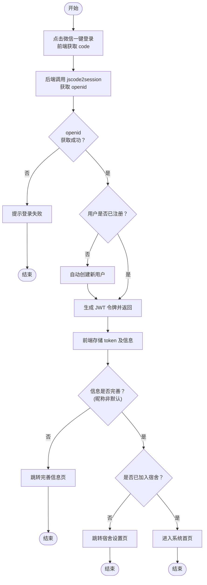

```mermaid
flowchart TD
    A([开始]) --> B["点击微信一键登录\n前端获取 code"]
    B --> C["后端调用 jscode2session\n获取 openid"]
    C --> D{"openid\n获取成功？"}
    D -- 否 --> E["提示登录失败"]
    E --> Z1([结束])
    D -- 是 --> F{"用户是否已注册？"}
    F -- 否 --> G["自动创建新用户"]
    G --> H
    F -- 是 --> H["生成 JWT 令牌并返回"]
    H --> I["前端存储 token 及信息"]
    I --> J{"信息是否完善？\n(昵称非默认)"}
    J -- 否 --> K["跳转完善信息页"]
    K --> Z2([结束])
    J -- 是 --> L{"是否已加入宿舍？"}
    L -- 否 --> M["跳转宿舍设置页"]
    M --> Z3([结束])
    L -- 是 --> N["进入系统首页"]
    N --> Z4([结束])
```
