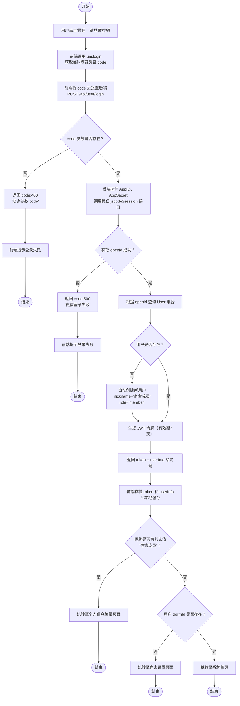

```mermaid
flowchart TD
    A([开始]) --> B["用户点击'微信一键登录'按钮"]
    B --> C["前端调用 uni.login\n获取临时登录凭证 code"]
    C --> D["前端将 code 发送至后端\nPOST /api/user/login"]
    D --> E{"code 参数是否存在？"}
    E -- 否 --> E1["返回 code:400\n'缺少参数 code'"]
    E1 --> E2["前端提示登录失败"]
    E2 --> Z1([结束])
    E -- 是 --> F["后端携带 AppID、AppSecret\n调用微信 jscode2session 接口"]
    F --> G{"获取 openid 成功？"}
    G -- 否 --> G1["返回 code:500\n'微信登录失败'"]
    G1 --> G2["前端提示登录失败"]
    G2 --> Z2([结束])
    G -- 是 --> H["根据 openid 查询 User 集合"]
    H --> I{"用户是否存在？"}
    I -- 否 --> J["自动创建新用户\nnickname='宿舍成员'\nrole='member'"]
    J --> K["生成 JWT 令牌（有效期7天）"]
    I -- 是 --> K
    K --> L["返回 token + userInfo 给前端"]
    L --> M["前端存储 token 和 userInfo\n至本地缓存"]
    M --> N{"昵称是否为默认值\n'宿舍成员'？"}
    N -- 是 --> O["跳转至个人信息编辑页面"]
    O --> Z3([结束])
    N -- 否 --> P{"用户 dormId 是否存在？"}
    P -- 否 --> Q["跳转至宿舍设置页面"]
    Q --> Z4([结束])
    P -- 是 --> R["跳转至系统首页"]
    R --> Z5([结束])
```
