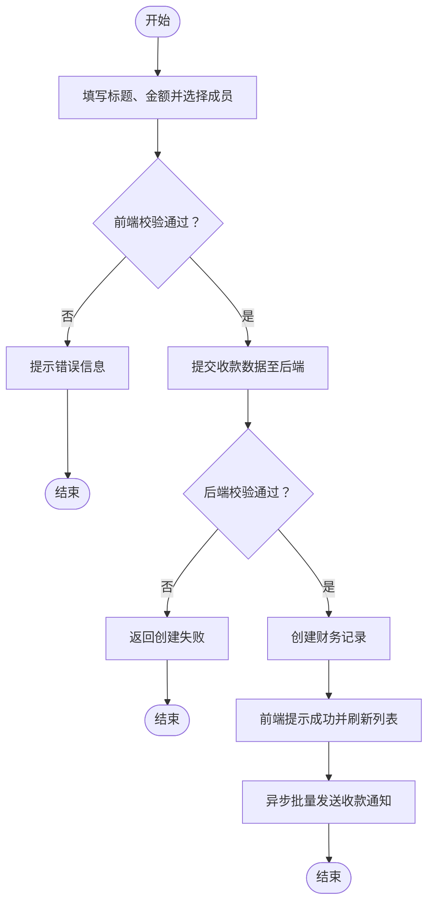

```mermaid
flowchart TD
    A([开始]) --> B["填写标题、金额并选择成员"]
    B --> C{"前端校验通过？"}
    C -- 否 --> C1["提示错误信息"]
    C1 --> Z1([结束])
    C -- 是 --> D["提交收款数据至后端"]
    D --> E{"后端校验通过？"}
    E -- 否 --> E1["返回创建失败"]
    E1 --> Z2([结束])
    E -- 是 --> F["创建财务记录"]
    F --> G["前端提示成功并刷新列表"]
    G --> H["异步批量发送收款通知"]
    H --> Z3([结束])
```
