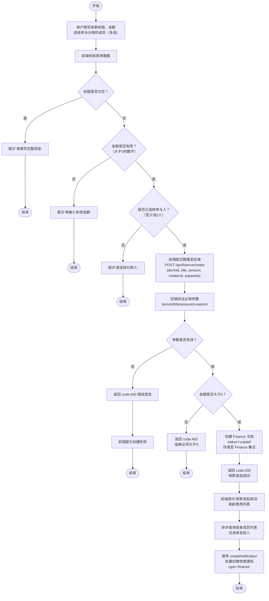

```mermaid
flowchart TD
    A([开始]) --> B["用户填写收款标题、金额\n选择参与分摊的成员（多选）"]
    B --> C["前端校验表单数据"]
    C --> D{"标题是否为空？"}
    D -- 是 --> D1["提示'请填写完整信息'"]
    D1 --> Z1([结束])
    D -- 否 --> E{"金额是否有效？\n（大于0的数字）"}
    E -- 否 --> E1["提示'请输入有效金额'"]
    E1 --> Z2([结束])
    E -- 是 --> F{"是否已选择参与人？\n（至少选1人）"}
    F -- 否 --> F1["提示'请选择付款人'"]
    F1 --> Z3([结束])
    F -- 是 --> G["前端提交数据至后端\nPOST /api/finance/create\n{dormId, title, amount, creatorId, payeeIds}"]
    G --> H["后端验证必填参数\ndormId/title/amount/creatorId"]
    H --> I{"参数是否有效？"}
    I -- 否 --> I1["返回 code:400 错误信息"]
    I1 --> I2["前端提示创建失败"]
    I2 --> Z4([结束])
    I -- 是 --> J{"金额是否大于0？"}
    J -- 否 --> J1["返回 code:400\n'金额必须大于0'"]
    J1 --> Z5([结束])
    J -- 是 --> K["创建 Finance 文档\nstatus='unpaid'\n存储至 Finance 集合"]
    K --> L["返回 code:200\n'收款发起成功'"]
    L --> M["前端提示'收款发起成功'\n刷新费用列表"]
    M --> N["异步查询宿舍成员列表\n过滤掉发起人"]
    N --> O["调用 createNotification\n批量创建收款通知\ntype='finance'"]
    O --> Z6([结束])
```
