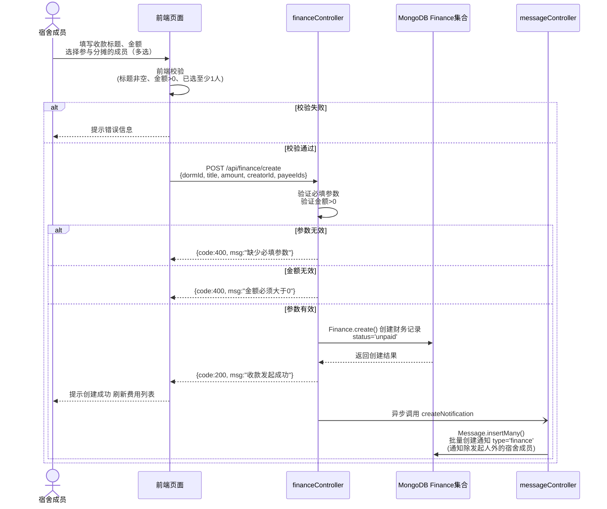

```mermaid
sequenceDiagram
    actor 用户 as 宿舍成员
    participant 前端 as 前端页面
    participant 后端 as financeController
    participant DB as MongoDB Finance集合
    participant 消息 as messageController

    用户->>前端: 填写收款标题、金额<br/>选择参与分摊的成员（多选）
    前端->>前端: 前端校验<br/>(标题非空、金额>0、已选至少1人)

    alt 校验失败
        前端-->>用户: 提示错误信息
    else 校验通过
        前端->>后端: POST /api/finance/create<br/>{dormId, title, amount, creatorId, payeeIds}
        后端->>后端: 验证必填参数<br/>验证金额>0

        alt 参数无效
            后端-->>前端: {code:400, msg:"缺少必填参数"}
        else 金额无效
            后端-->>前端: {code:400, msg:"金额必须大于0"}
        else 参数有效
            后端->>DB: Finance.create() 创建财务记录<br/>status='unpaid'
            DB-->>后端: 返回创建结果
            后端-->>前端: {code:200, msg:"收款发起成功"}
            前端-->>用户: 提示创建成功 刷新费用列表

            后端-)消息: 异步调用 createNotification
            消息->>DB: Message.insertMany()<br/>批量创建通知 type='finance'<br/>(通知除发起人外的宿舍成员)
        end
    end
```
