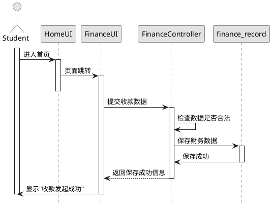

````

```plantuml
@startuml
skinparam monochrome true
skinparam maxMessageSize 100
skinparam responseMessageBelowArrow true
hide footbox

actor Student
participant HomeUI
participant FinanceUI
participant FinanceController
participant finance_record

activate Student

Student -> HomeUI: 进入首页
activate HomeUI

HomeUI -> FinanceUI: 页面跳转
activate FinanceUI
deactivate HomeUI

FinanceUI -> FinanceController: 提交收款数据
activate FinanceController

FinanceController -> FinanceController: 检查数据是否合法
FinanceController -> finance_record: 保存财务数据
activate finance_record

finance_record --> FinanceController: 保存成功
deactivate finance_record

FinanceController --> FinanceUI: 返回保存成功信息
deactivate FinanceController

FinanceUI --> Student: 显示"收款发起成功"
deactivate FinanceUI

deactivate Student
@enduml
````

```

```
